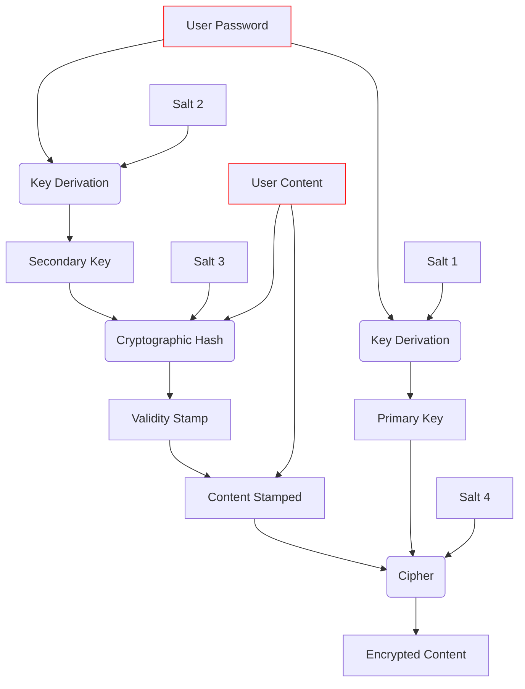

[](https://github.com/mateuskahler/kriptoTulha/actions/workflows/action-automated-tests.yml) [](https://github.com/mateuskahler/kriptoTulha/actions/workflows/action-build-ubuntu.yml) [](https://github.com/mateuskahler/kriptoTulha/actions/workflows/action-build-windows.yml)  

# kriptoTulha
A set of Python functions to store data securely.

I used to keep a text file on my desktop with a lot of personal data. Realizing that the habit was growing dangerous, I decided to build a program to encrypt the content.

After studying cryptographic primitives, I created an application to browse my personal notes and passwords.


## User Interface Usage
Once I was satisfied with the script, I decided to export it as a standalone executable. You can clone the repository and run the Python script or download the executable.

The executables are available on the [releases page](https://github.com/mateuskahler/kriptoTulha/releases), and instructions on how to build it yourself are presented below. 

To launch the User Interface as a Python script, execute `kriptoTulhaUI.py`:
```sh
python kriptoTulhaUI.py
```

The requirements are listed in `requirements.txt`, and can be installed with
```sh
pip3 install -r requirements.txt
```

This project requires Python >= 3.10, mostly because I enjoy using the type hints.

If you want to compile the script as a standalone executable yourself:
```
pyinstaller --noconsole --onefile --hidden-import argon2-cffi --hidden-import python-Levenshtein ./kriptoTulhaUI.py
```

These are the options I used. For details, take a look at [pyinstaller](https://pyinstaller.org/) homepage.  
Once compiled (or if you downloaded the program) the dependencies are no longer needed to run the application. 

## Details

Items are manipulated as *title* and *content* pairs, but are never saved to disk in readable form. Decoding them requires providing a user-defined password. The encryption scheme follows:




`Key derivation` is done using Argon2, a memory hard funtion.  
`Validation` is done using Blake2b, a cryptographic hash function.  
`Encryption` is done with ChaCha20, a stream cipher.  

### Key Deviration
Two keys are derived from the user provided password, in combination with random generated salts. The salts are called `Salt 1` and `Salt 2`, and the keys are called `Primary Key` and `Secondary Key`, repectively.  
### Validity Check
A cryptographic hash stamp of the content is generated, the function uses the `Secondary Key` with a new salt, `Salt 3`.   
The stamp is appended to the content to be encrypted as a mean to verify that the correct password is provided during decryption (the decryption cipher will output _something_, no mather what password is provided, but its unlikely that the wrong password will also return the correct hash).
### Encryption
The content, along with `Salt 2` and the `Validity Stamp`, are fed to a cipher using the `Primary Key` and a newly generated salt, called `Salt 4`.

## Output File

<!--  -->


The file is saved on disk containing an unencrypted layer with enough information to regenerate the decryption `Primary key` if the user provides the correct password, this layer contains `Salt 1` and `Salt 4`, of 16 and 12 bytes, respectively.  

Once decrypted, the main layer contains `Salt 2`, which is used to generate the `Secondary key`. The `Secondary key` is used in conjunction with `Salt 3`, which is integrated into the `Validity Stamp`, to compare the resulting cryptographic hash of the content with the expected value.

The hashes matching, the contents of the items are reconstructed. Items are arranged contiguously in the decrypted stream, as pairs of utf-8 strings, preceded by their size in bytes.

# Development 
The program consists of three main modules:
- Tulha, which exposes a class to store items.
- Crypto, which contains routines to encrypt and verify data.
- User interface.

Code style is enforced by `autopep8` and `flake8`, which are listed in the `dev_requirements.txt` file.


# Tests
Tests of encryption and storage routines can be performed with:  
`python -m unittest -v`

The tests are also run as a Github action on pull requests.
