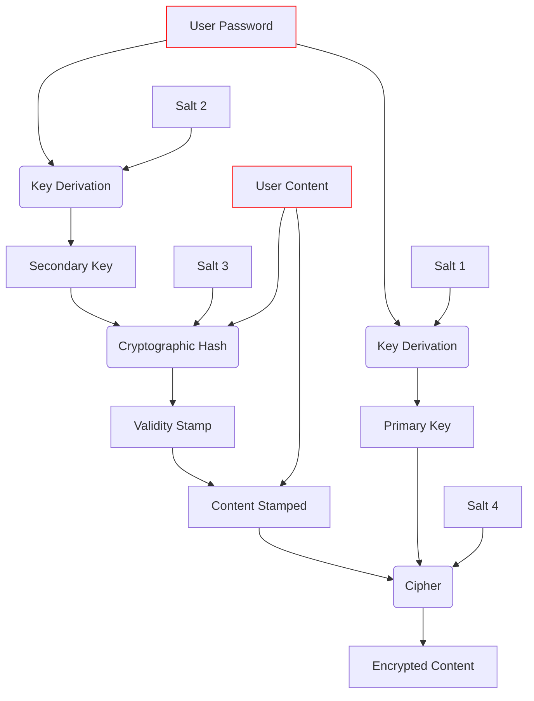

[](https://github.com/mateuskahler/kriptoTulha/actions/workflows/action-automated-tests.yml)  
# kriptoTulha
A set of Python functions to store data securely.

I used to keep a text file on my desktop with a lot of personal data. Realizing that the habit was growing dangerous, I decided to create a program to encrypt the data.

I used the chance to study cryptographic primitives and build a user interface for navigating my personal notes. 

// User interface under development

## Usage
The user interface can by lauched with
```sh
python xxxxxx
```

The requirements are listed in `requirements.txt`, and can be installed with
```sh
pip3 install -r requirements.txt
```

## Details

Items are stored as *title* and *content* pairs, but are never saved to disk in readable form. Decoding them requires providing a user-defined password. The encryption scheme follows:




`Key derivation` is done using Argon2, a memory hard funtion.  
`Validation` is done using Blake2b, a cryptographic hash function.  
`Encryption` is done with ChaCha20, a stream cipher.  

### Key Deviration
The inputs are a user provided password and the content to encrypt.  
Two keys are derived from the user provided password, in combination with random generated salts. The salts are called `Salt 1` and `Salt 2`, and the keys are called `Primary Key` and `Secondary Key`, repectively.  
### Validity Check
A cryptographic hash stamp of the content is generated, the function uses the `Secondary Key` with a new salt, `Salt 3`.   
The stamp is appended to the content to be encrypted as a mean to verify that the correct password is provided during decryption (the decryption cipher will output _something_, no mather what password is provided, but its unlikely that the wrong password will also return the correct hash).
### Encryption
The content, along with `Salt 2` and the `Validity Stamp`, are fed to a cipher using the `Primary Key` and a newly generated salt, called `Salt 4`.

## Output File

// Data format illustration under development

# Development 
The program consists of three main modules:
- Tulha, which exposes a class to store items.
- Crypto, which contains routines to encrypt and verify data.
- User interface.

Code style is enforced by `autopep8` and `flake8`, which are listed in the `dev_requirements.txt` file.


# Tests
I also took the opportunity to study Python's built-in `unittest` module.  
To run all the tests:  
`python -m unittest`

The tests are also run as a Github action on pull requests.
